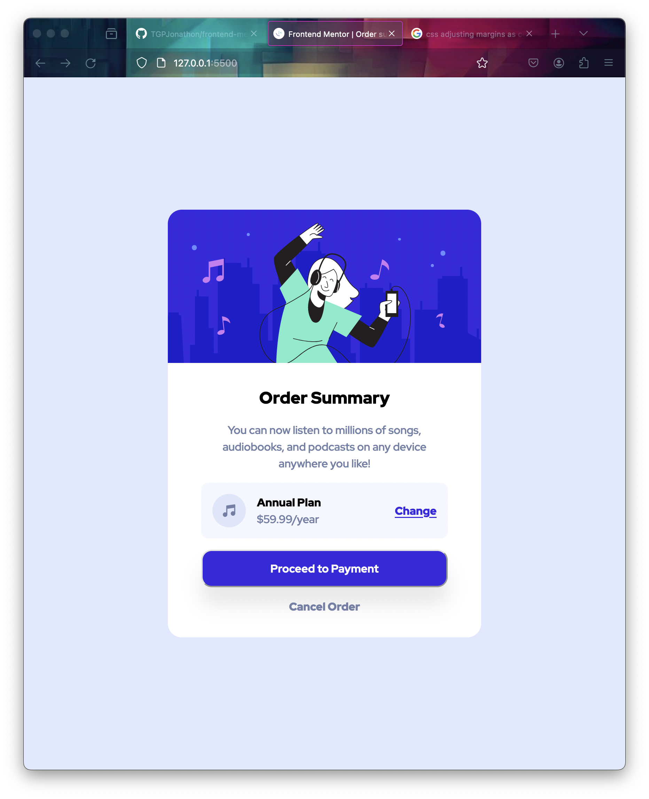

# Frontend Mentor - Order summary card solution

This is a solution to the [Order summary card challenge on Frontend Mentor](https://www.frontendmentor.io/challenges/order-summary-component-QlPmajDUj). Frontend Mentor challenges help you improve your coding skills by building realistic projects.

## Table of contents

- [Overview](#overview)
  - [Screenshot](#screenshot)
  - [Links](#links)
- [My process](#my-process)
  - [Built with](#built-with)
  - [What I learned](#what-i-learned)
  - [Continued development](#continued-development)

## Overview

This one wasn't too bad. For some reason display: grid and place-content:center did not work. I ended up going with margin: auto, but the behavior was weird.

Overall, this one didn't take too much time. I implemented feedback I received in a previous challenge and started using min-height and min for responsive components.

### Screenshot

### Links

- Solution URL: [https://github.com/TGPJonathon/frontend-mentor-order](https://github.com/TGPJonathon/frontend-mentor-order)
- Live Site URL: [https://tgpjonathon.github.io/frontend-mentor-order/](https://tgpjonathon.github.io/frontend-mentor-order/)

## My process

### Built with

- Semantic HTML5 markup
- CSS custom properties
- Grid & Flex

### What I learned

I learned more about responsive design.

### Continued development

I want to continue learning more about making responsive layouts.
